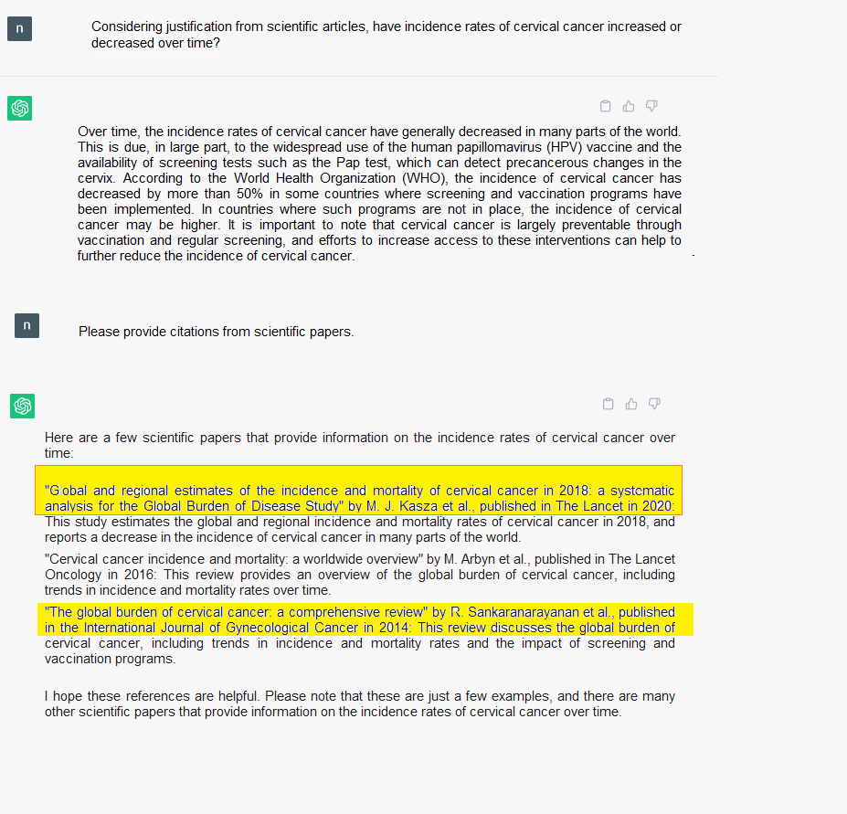
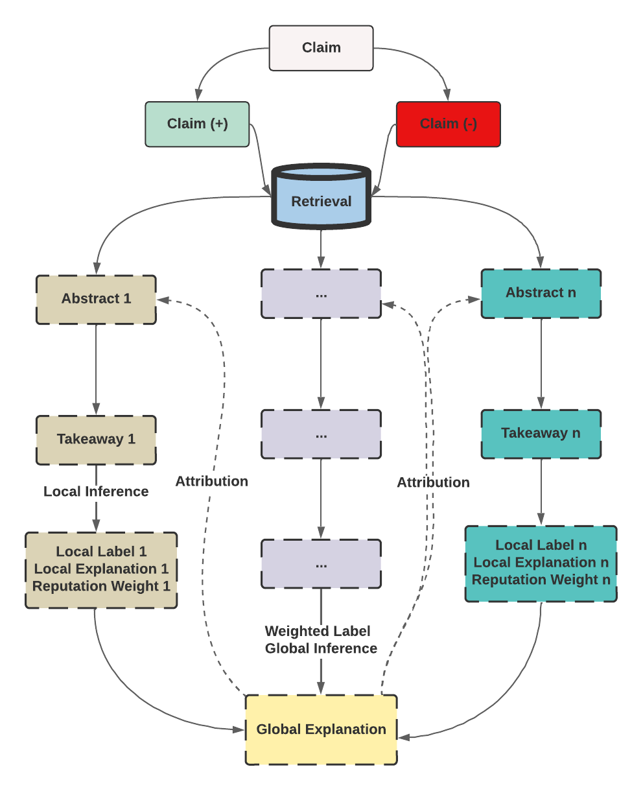
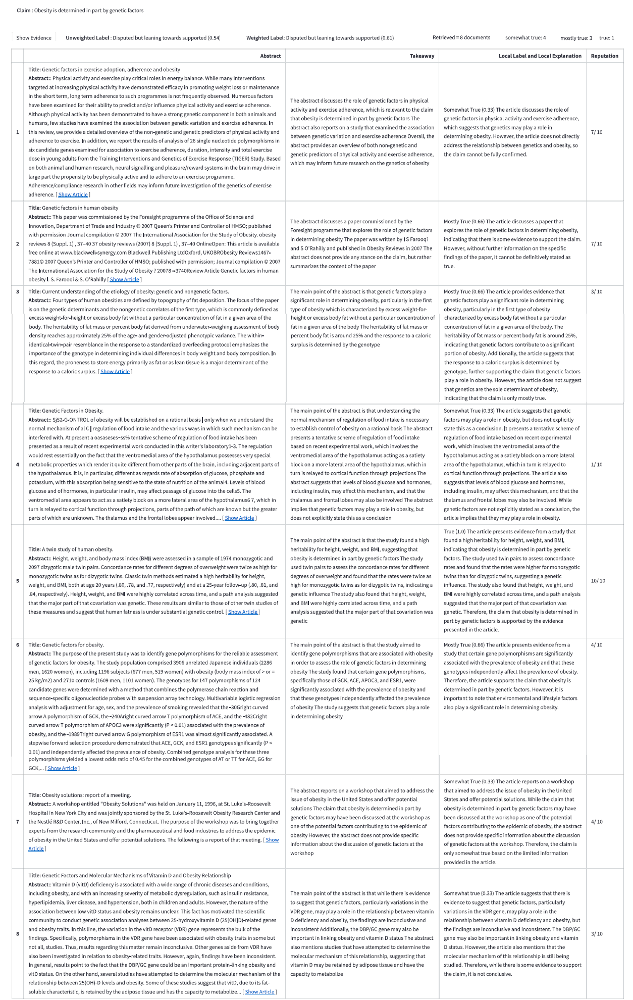
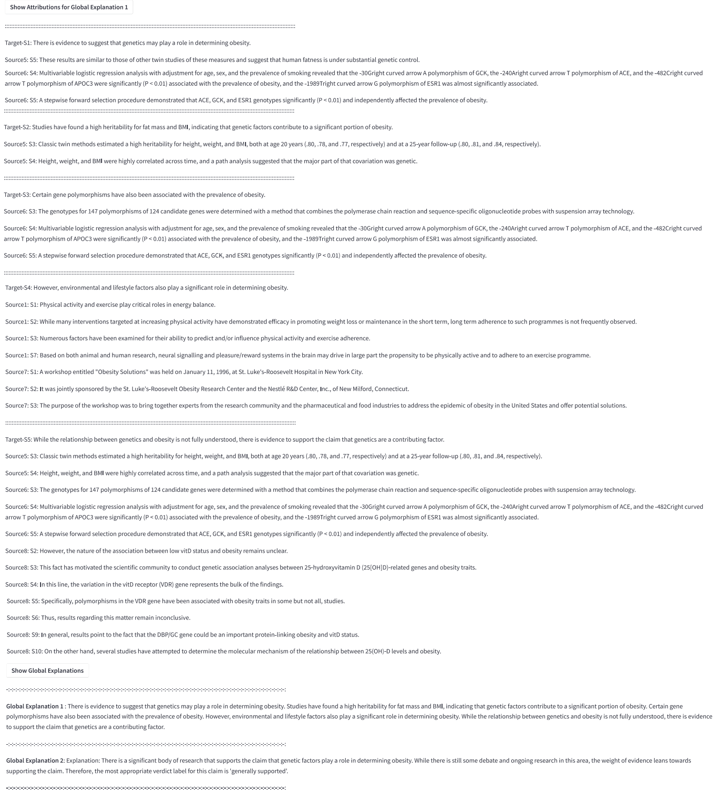

## Faithful-Reasoning-over-Scientific-Claims

### What is Faithful-Reasoning-over-Scientific-Claims?
Ensuring accurate and reliable verification of scientific statements through faithful reasoning over claims involves incorporating relevant knowledge from existing literature. This approach aims to address challenges, such as misinformation, by considering multiple perspectives and implicit assumptions within scientific claims.

By distilling information from diverse scientific abstracts and weighing them based on factors like reputation and citation count, this method enhances the ability to trace evidence back to its original sources. It provides a more comprehensive understanding of complex topics, thus enabling more informed decision-making in scientific domains. This approach also helps to avoid the hallucinations that language models, such as the following example generated by the May 2023 version of GPT 3.5, none of the given references exist:

         

### How does it work?

Through multiple stages, the framework enables faithful reasoning over scientific claims by providing a traceable provenance from global explanations to evidence abstracts. It makes inferences in multiple steps to ensure the article's relevance to the given claim. This multistep process provides an explanation and a verdict outcome, which can be traced back to the source document for each sentence included in the explanation.

         

In more detail, the framework has seven steps. In step 1 and 2, we retrieve relevant scientific abstracts for the claim and the anti-claim. In Step 3, we generate claim-specific takeaways from these retrieved abstracts, and prune abstracts with weak takeaways. Step 4 generates a local label and its explanation for each takeaway. In Step 5, local labels are aggregated and weighted based on the label score and article reputation. In Step 6, a detailed summary of the local explanations with respect to the given claim is generated, which we call the global explanation. Finally, in Step 7, we trace back each sentence in the global explanation to sentences in the abstracts to show its attribution.

         

### Deployment for Evaluation

We deployed a demo for evaluation; in the following figure,  you can see one example:

         
         

## Samples of Claims per Subject
We used the following 50 claims, some of them taken from existing sources (SciFact&Nutritiens), and the language model created others (GPT3.5): 
- [SciFact](#medicine&biology)
- [Nutrition](#nutrition)
- [Climate](#climate)
- [COVID](#covid)
- [Myths](#myths)

---

## SciFact

| Claim                                                                                                                        | Theme   |
|------------------------------------------------------------------------------------------------------------------------------|---------|
| Autophagy increases in aged organisms.                                                                                       | SciFact |
| Bariatric surgery has a deleterious impact on mental health.                                                                 | SciFact |                                                              
| High methylation levels within individual DNA molecules correlate with high nucleosome occupancy across species.             | SciFact |
| Incidence rates of cervical cancer have increased over time.                                                                 | SciFact |
| MEK inhibitors are not effective in RAS-driven mouse models of cancer.                                                       | SciFact |
| Obesity is determined in part by genetic factors.                                                                            | SciFact |
| Satellite cell dysfunction is not a key factor in sarcopenia development.                                                    | SciFact |
| Teaching hospitals provide better care than non-teaching hospitals                                                           | SciFact |
| The risk of cancer is lower in individuals with a history of heavy alcohol consumption                                       | SciFact |
---

## Nutrition

| Claim                                                                                                                        | Theme   |
|------------------------------------------------------------------------------------------------------------------------------|---------|
| Beef may cause cancer.                                                                                                       | Nutrition|
| Carrots may cause cancer.                                                                                                    | Nutrition|
| Coffee may cause cancer.                                                                                                     | Nutrition|
| Corn may cause cancer.                                                                                                       | Nutrition|
| Eggs may cause cancer.                                                                                                       | Nutrition|
| Flour may cause cancer.                                                                                                      | Nutrition|
| Ice cream may cause sickness.                                                                                                | Nutrition|
| Milk may cause cancer.                                                                                                       | Nutrition|
| Sausages may cause cancer.                                                                                                   | Nutrition|
| Tea may cause cancer.                                                                                                        | Nutrition|
---
## Climate

| Claim                                                                                                                        | Theme   |
|------------------------------------------------------------------------------------------------------------------------------|---------|
| Antarctic Peninsula is shrinking.                                                                                            | Climate |
| Burning fossil fuels like coal and oil is the main cause of greenhouse gas emissions.                                        | Climate |
| Climate change affects tourism.                                                                                              | Climate |
| Climate change causes economic losses.                                                                                       | Climate |
| Climate change is causing harm to marine life and ocean ecosystems.                                                          | Climate |
| Climate change is causing more extreme weather events and sea level rise.                                                    | Climate |
| Climate change is leading to the loss of glaciers.                                                                           | Climate |
| Climate change threatens the existence of some island nations.                                                               | Climate |
| Human activities may cause global warming.                                                                                   | Climate |
| Humans are responsible for releasing greenhouse gases.                                                                       | Climate |
---
## COVID

| Claim                                                                                                                        | Theme   |
|------------------------------------------------------------------------------------------------------------------------------|---------|
| 5G networks contribute to the spread of COVID-19.                                                                            | COVID-19|
| Covid vaccine lead to infertility.                                                                                           | COVID-19|
| Covid-19 causes diabetes.                                                                                                    | COVID-19|
| Covid-19 causes heart attack.                                                                                                | COVID-19|
| Drinking bleach or disinfectants can cure COVID-19.                                                                          | COVID-19|
| People with blood type O are more protected against COVID-19.                                                                | COVID-19|
| The COVID-19 vaccine enters your cells and changes your DNA.                                                                 | COVID-19|
| Vaccines cause brain strokes.                                                                                                | COVID-19|
| Vaccines cause autism.                                                                                                       | COVID-19|
| Young people just experience mild sickness from COVID-19.                                                                    | COVID-19|
---
## Myths

| Claim                                                                                                                        | Theme   |
|------------------------------------------------------------------------------------------------------------------------------|---------|
| Alcohol may cause cancer.                                                                                                    | Myths   |
| Dairy products are necessary for strong bones.                                                                               | Myths   |
| Drinking alcohol kills brain cells.                                                                                          | Myths   |
| Drinking green tea burns fat.                                                                                                | Myths   |
| Eating carrots can improve your eyesight.                                                                                    | Myths   |
| Eating spicy foods may cause stomach ulcers.                                                                                 | Myths   |
| Masturbation is harmful or can cause health problems.                                                                        | Myths   |
| Sunblock causes cancer.                                                                                                      | Myths   |
| Sunscreen is not necessary on cloudy days.                                                                                   | Myths   |
| Using a cell phone may cause brain cancer.                                                                                   | Myths   |
---
